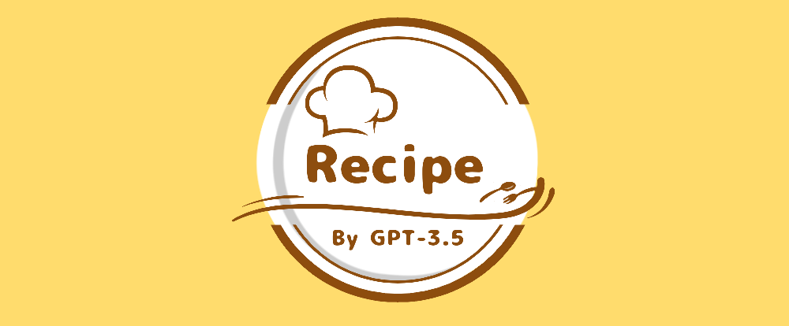
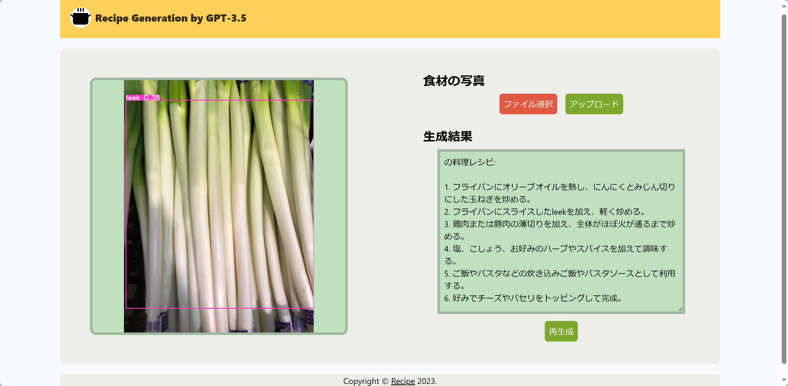

<h1>recipe</h1>

<h2>食材の画像からGPT-3.5がレシピを提案</h2>
<ul>
<li>

毎日の献立を考えるのが大変

</li>
<li>

冷蔵庫にある食材を消費したい

そんな悩みを着想点としたWebアプリです．

<h2>データセット</h2>
https://www.kaggle.com/datasets/kvnpatel/fruits-vegetable-detection-for-yolov4  
https://www.kaggle.com/datasets/ayyuce/vegetables  
上記リンクからダウンロード後，ObjectDetection/dataフォルダに展開する．

<h2>対象となる野菜・果物</h2>
<li>apple</li>
<li>banana</li>
<li>blackberries</li>
<li>chilli</li>
<li>grapes</li>
<li>lemon</li>
<li>raspberry</li>
<li>tomato</li>
<li>lettuce</li>
<li>potato</li>
<li>carrot</li>
<li>onion</li>
<li>garlic</li>
<li>leek</li>
<li>broccoli</li>

<h2>技術スタック</h2>
<li>React</li>
<li>Tailwind</li>
<li>Flask</li>
<li>Open AI</li>
<li>Python</li>
<li>ultralytics YOLOv8</li>

<h2>画面構成</h2>

<h2>開発時期</h2>

2023年9月末~

<h2>ビルドと立ち上げ</h2>
<blockquote>

【参考】

<ul>
<li>

<a href=https://qiita.com/Mozuha/items/b24dc62101e1ecbd432c>https://qiita.com/Mozuha/items/b24dc62101e1ecbd432c</a>

</li>
</ul>
</blockquote>

<pre>
<button class="fa fa-copy clip-button" title="Copy to clipboard" aria-label="Copy to clipboard"><i class="tooltiptext"></i></button>
<code class="language-bash hljs">cd react_recipe_app
npm run build
cd ../flask_backend
python web_app.py
</code></pre>